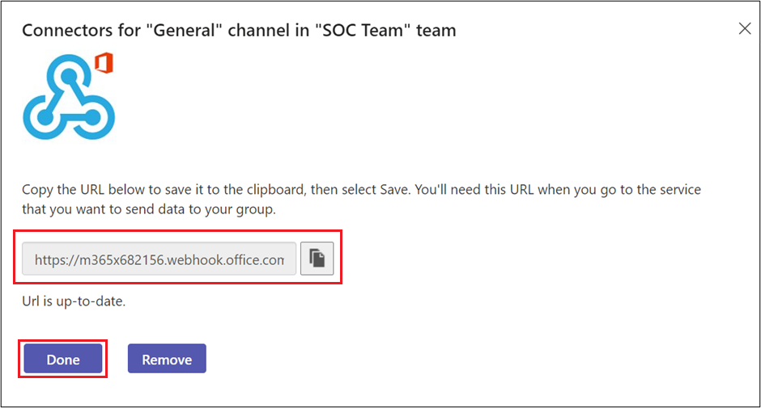

# Jenkins

PIMS uses Jenkins to automate the deployment pipelines

## Service Account

The service account Jenkins will use needs to be created and referenced in each namespace it will have access to.

- Login with the `oc`

```bash
cd openshift/4.0/templates/jenkins
oc process -f rolebinding.yaml | oc create --save-config=true -f -
```

## How to deploy Jenkins Master

We deploy the Jenkins Master using the [jenkins-master.yaml](./jenkins-master.yaml)

- (Optional) Create a `.env` file with the following.

```conf
APP_NAME=jenkins
PROJECT_NAME=3cd915-tools
ENV_NAME=tools
NAMESPACE=3cd915
DOMAIN=apps.silver.devops.gov.bc.ca
```

- Run the following the `oc` command to create Jenkins pod

```bash
oc process jenkins-slave.yaml | oc apply -f -
#  if customising the deployment using the .env file
oc process jenkins-slave.yaml --param-file=.env | oc apply -f -
```

## Secrets

The Jenkins CI/CD pipelines below send automated notifications when builds are completed or an error was encountered. The samples below show how to send notifications for Rocket Chat and MS Teams. For any other instant messaging platform, you might need to adjust the scripts accordingly.

### Microsoft Teams

> Replace anything in angle brackets with the appropriate value!

First, create an [incoming webhook](https://docs.microsoft.com/en-us/microsoftteams/platform/webhooks-and-connectors/how-to/add-incoming-webhook) in MS Teams so the pipeline can send notifications to your teams channel.

https://docs.microsoft.com/en-us/microsoftteams/platform/webhooks-and-connectors/how-to/add-incoming-webhook

In MS Teams:

1. Go to the channel where you want to add the webhook and select ••• **More options** from the top navigation bar.
2. Search for **Incoming Webhook** and select **Add**.
3. Select **Configure**, provide a name, and upload an image for your webhook if required:
4. The dialog window presents a unique URL that maps to the channel. Copy and save the webhook URL, to send information to Microsoft Teams and select **Done**



Create a secret in OpenShift with the webhook URL. The next section, will show how to modify the DevOps pipeline to access this secret for sending notifications.

```bash
oc project 3cd915-tools

oc create secret generic ms-teams-secrets \
  --from-literal=notification-webhook=<webhook_url>
```

### Rocket Chat

> Replace anything in angle brackets with the appropriate value!

In Rocket Chat:

1. Create an incoming webhook in the channel you want notifications to be sent to
2. Copy the webhook URL. You will need it in next steps

Create a secret in OpenShift with the webhook URL. The next section, will show how to modify the DevOps pipeline to access this secret for sending notifications.

```bash
oc project 3cd915-tools

oc create secret generic rocket-chat-secrets \
  --from-literal=rocket-deploy-webhook=<webhook_url>
```

## Configure the DEV CI/CD Pipeline

Jenkins is being used to orchestrate jobs between GitHub and OpenShift. Anytime a Pull Request is opened against the dev/master branch, it triggers a job on Jenkins which runs the pipeline stages and reports the status back to GitHub.

This project makes use of several pipelines. For each one, use the generic pipeline template located at `openshift/4.0/templates/jenkins/generic-pipeline.yaml` and customize with appropriate values.

### 1 cicd-pipeline

1. View the parameters `oc process --parameters -f openshift/4.0/templates/jenkins/generic-pipeline.yaml`

2. Create a **`.env`** file that contains the values for the parameters within the template
   ```
   NAME=cicd
   JENKINSFILE_PATH=openshift/4.0/pipelines/Jenkinsfile.cicd
   ```
3. Create the pipeline objects `oc process --param-file=[.env] -f openshift/4.0/templates/jenkins/generic-pipeline.yaml | oc create -f -`

4. Make sure to edit **Jenkinsfile.cicd** to update any references to the notification secrets configured in the previous section **Secrets**.

### 2 dev-to-test-pipeline

1. View the parameters `oc process --parameters -f openshift/4.0/templates/jenkins/generic-pipeline.yaml`

2. Create a **`.env`** file that contains the values for the parameters within the template

   ```
   NAME=promote-to-test
   JENKINSFILE_PATH=openshift/4.0/pipelines/Jenkinsfile.promote-to-test
   ```

3. Create the pipeline objects `oc process --param-file=[.env] -f openshift/4.0/templates/jenkins/generic-pipeline.yaml | oc create -f -`

### 3 dev-alpha-pipeline

The dev alpha pipeline is used to test unreleased features that may not have a complete implementation or includes a design that is not ready to be included in the regular PIMS release lifecycle. The alpha pipeline allows developers to share these kinds of changes with other developers and non-technical users in a similar manner to the core PIMS git flow, but using the dev-alpha branch instead of the regular dev branch. Note that the dev-alpha-pipeline uses the original Jenkinsfile.cicd configuration.

1. View the parameters `oc process --parameters -f openshift/4.0/templates/jenkins/generic-pipeline.yaml`

2. Create a **`.env`** file that contains the values for the parameters within the template

   ```
   APP_NAME=pims-alpha
   ```

3. Create the pipeline objects `oc process --param-file=[.env] -f openshift/4.0/templates/jenkins/generic-pipeline.yaml | oc create -f -`

### 4 dev-test-pipeline

1. View the parameters `oc process --parameters -f openshift/4.0/templates/jenkins/generic-pipeline.yaml`

2. Create a **`.env`** file that contains the values for the parameters within the template

   ```
   NAME=dev-test

   JENKINSFILE_PATH=openshift/4.0/pipelines/Jenkinsfile.dev-to-test
   ```

3. Create the pipeline objects `oc process --param-file=[.env] -f openshift/4.0/templates/jenkins/generic-pipeline.yaml | oc create -f -`

### 5 push-to-prod-pipeline

1. View the parameters `oc process --parameters -f openshift/4.0/templates/jenkins/generic-pipeline.yaml`

2. Create a **`.env`** file that contains the values for the parameters within the template

   ```
   NAME=push-to-prod
   JENKINSFILE_PATH=openshift/4.0/pipelines/Jenkinsfile.dev-to-test
   OC_JOB_NAME=master
   ENV_NAME=prod
   ENABLE_VERSION_PROMPT=true
   VANITY_URL=https://pims.gov.bc.ca/
   ```

3. Create the pipeline objects `oc process --param-file=[.env] -f openshift/4.0/templates/jenkins/generic-pipeline.yaml | oc create -f -`

### 6 master-pipeline

1. View the parameters `oc process --parameters -f openshift/4.0/templates/jenkins/generic-pipeline.yaml`

2. Create a **`.env`** file that contains the values for the parameters within the template

   ```
   NAME=master
   JENKINSFILE_PATH=openshift/4.0/pipelines/Jenkinsfile.dev-to-test
   OC_JOB_NAME=master
   ENV_NAME=prod
   ENABLE_VERSION_PROMPT=true
   VANITY_URL=https://pims.gov.bc.ca/
   ```

3. Create the pipeline objects `oc process --param-file=[.env] -f openshift/4.0/templates/jenkins/generic-pipeline.yaml | oc create -f -`
