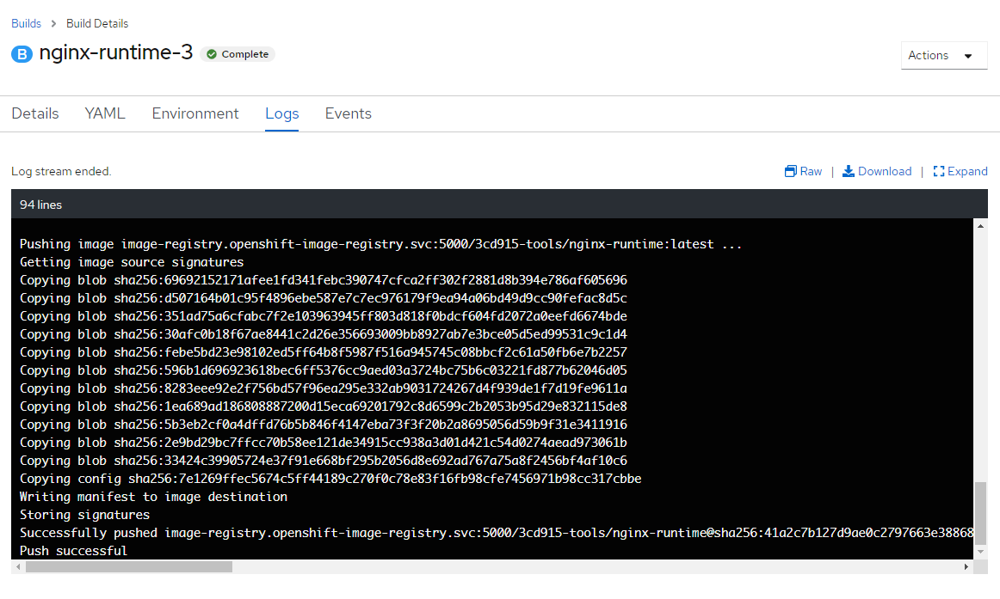

# Import Images

For the tech stack chosen for PIMS, we need to import the following base images into our OpenShift **tools** namespace:

- NET Core 3.1 SDK and Runtime
- Microsoft SQL Server 2019

Go to - `/psp/openshift/4.0/templates/base-images`

```bash
$ oc project 3cd915-tools

$ oc process -f dotnet-31.yaml | oc create -f -

$ oc process -f mssql-2019.yaml | oc create -f -
```

## S2I Images

PIMS uses a custom **Source-to-Image (S2I)** Nginx image that requires you to build and push to the Image Repository.

### Option 1 (Recommended)

This option is recommended because Docker Hub imposes a rate limit on daily image pulls (max = 200 pulls/day). Since all applications deployed to OpenShift share a common IP you will get docker errors when trying to build **nginx-runtime** in OpenShift because the rate limit has been reached.

Go to - `/openshift/s2i/nginx-runtime`

Next create an empty image stream **nginx-base** in your project for the image using `oc create imagestream`.

```bash
$ oc create imagestream nginx-base
imagestream "nginx-base" created
```

Pull the latest **nginx** image from Docker Hub into your local workstation

```bash
$ docker pull nginx:mainline
...
Status: Downloaded newer image for nginx:mainline
```

If you are already logged in to the OpenShift cluster from the command line, you can authenticate to the internal image registry using `docker`:

```bash
$ docker login -u $(oc whoami) -p $(oc whoami -t) image-registry.apps.silver.devops.gov.bc.ca
# Or you can run this command.
$ oc registry login
```

**IMPORTANT:** Before you can push an image to the internal registry you need to login to it using the tool you are using (docker or oc cli)

Next tag the local image you wish to push with the details of the image registry, your project in OpenShift, the name of the image stream and image version tag.

```bash
$ docker tag nginx:mainline image-registry.apps.silver.devops.gov.bc.ca/3cd915-tools/nginx-base:mainline
```

- Note how the local image is **nginx:mainline** but we want the remote image in OpenShift to be **nginx-base:mainline**

You are then ready to push the image to the OpenShift internal image registry.

```bash
$ docker push image-registry.apps.silver.devops.gov.bc.ca/3cd915-tools/nginx-base:mainline
# you should see something like this...
The push refers to repository [image-registry.apps.silver.devops.gov.bc.ca/3cd915-tools/nginx-base]
...
mainline: digest: sha256:<_shaDigest_> size: 1570
```

Create image stream and associated build configurations for nginx-runtime for **the following environments:**

- DEV
- TEST
- UAT

Create a build configuration file here - `build.dev.env`
Update the configuration file and set the appropriate parameters.

**Example**

```conf
GIT_REF=dev
OUTPUT_IMAGE_TAG=dev
```

Create the **nginx-runtime** build for each environment

```bash
# DEV (from dev branch)
$ oc process -f nginx-runtime.yaml --param-file=build.dev.env | oc create -f -
```

For **TEST**

`build.test.env`

```conf
GIT_REF=test
OUTPUT_IMAGE_TAG=test
```

```bash
# TEST (from test branch)
$ oc process -f nginx-runtime.yaml --param-file=build.test.env  | oc create -f -
```

For **UAT**

`build.uat.env`

```conf
GIT_REF=master
OUTPUT_IMAGE_TAG=tag
```

```bash
# UAT (from master branch)
$ oc process -f nginx-runtime.yaml --param-file=build.uat.env  | oc create -f -
```

Finally, you can kick off the builds in OpenShift for **nginx-runtime** for the various environments (DEV, TEST, UAT)

```bash
$ oc start-build nginx-runtime.dev
$ oc start-build nginx-runtime.test
$ oc start-build nginx-runtime.uat
```

You should watch the build in OpenShift. If everything went smoothly you should see something like this.



### Option 2

> **NOTE -** This approach will require that you build the end image **nginx-runtime** locally and then push it to OpenShift, bypassing the **S2I** build process altogether. It is recommended that you let OpenShift build the nginx runtime image as set out in option 1 above.

Go to - `/openshift/s2i/nginx-runtime`

Create an image stream for this image.

```bash
$ oc process -f nginx-runtime.yaml | oc create -f -
```

Build and tag the image.

```bash
$ docker build -t nginx-runtime .
$ docker tag nginx-runtime image-registry.apps.silver.devops.gov.bc.ca/3cd915-tools/nginx-runtime
```

Login to OpenShift with docker and push the image to the Image Repository.

```bash
$ docker login -u $(oc whoami) -p $(oc whoami -t) image-registry.apps.silver.devops.gov.bc.ca
# Or you can run this command.
$ oc registry login

$ docker push image-registry.apps.silver.devops.gov.bc.ca/354028-tools/nginx-runtime
```

### Apply changes to existing base images

If you make changes to the base images, you will need to push the updates to OpenShift. For this, use **oc replace** instead of oc create.

```bash
$ oc project 3cd915-tools

$ oc process -f dotnet-31.yaml | oc replace -f -

$ oc process -f msssql-2019.yaml | oc replace -f -
```
