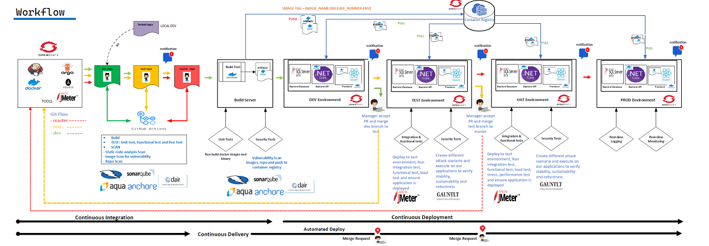

## DevSecOps

The purpose and intent of DevSecOps is to build on the mindset that “everyone is responsible for security” to safely distribute security decisions at speed and scale to those who hold the highest level of context without sacrificing the safety required. – Shannon Lietz


The PIMS Project undertake a number of scan (Static and Vulnerability) as part of our software release pipeline, and do not release if "HIGH RISK" vulnerabilities are identified (Automated, Continous process)

### CODE:
Run Static Code Analysis in Real-time to address vulnerabilities in the code at real-time. We do not have to wait once per quarter or wait until the release to production before scanning. Open-source tools for Static Code Analysis can be used within the CI pipeline and Git Actions:

- [Sonarque](https://docs.sonarqube.org/latest/analysis/github-integration/)
- [CodeQL](https://github.com/github/codeql-action)


#### Static Code Analysis for React Frontend

The Project uses Sonarque as a Static Code Analysis and Quality Assurance Tool to collect and analyses our source code and provide reports for the code quality of our project

**Requirement:**
- [Sonarque Server](https://github.com/BCDevOps/sonarqube) (community version - free)
- Sonarque cli for Javascript/Typescript (github action)

*GitHub Actions for PIMS Frontend Static Code Analysis*

```
  - name: SonarQube Scan
        id: scan
        uses: sonarsource/sonarqube-scan-action@master
        env:
          SONAR_TOKEN: ${{ secrets.SONAR_TOKEN }}
          SONAR_HOST_URL: ${{ secrets.SONAR_URL }}
          PROJECT_KEY: ${{secrets.PROJECT_KEY_APP}}
          PROJECT_NAME: PIMS-APP
          GITHUB_TOKEN: ${{ secrets.GITHUB_TOKEN }}
        with:
          projectBaseDir: ${{env.working-directory}}
          args: >
            -Dsonar.projectKey=${{env.PROJECT_KEY}}
            -Dsonar.projectName=${{env.PROJECT_NAME}}
            -Dsonar.qualitygate.wait=true
       
      - name: Find Comment
        if: failure() && steps.scan.outcome == 'failure' && github.event_name == 'pull_request'
        uses: peter-evans/find-comment@v1
        id: fc
        with:
          issue-number: ${{ github.event.pull_request.number }}
          comment-author: 'github-actions[bot]'
          body-includes: STATIC CODE QUALITY GATE STATUS
       
      - name: Check Quality Gate and Create Comment
        if: failure() && steps.scan.outcome == 'failure' && github.event_name == 'pull_request' && steps.fc.outputs.comment-id == ''
        uses: peter-evans/create-or-update-comment@v1
        env:
          SONAR_TOKEN: ${{ secrets.SONAR_TOKEN }}
          SONAR_HOST_URL: ${{ secrets.SONAR_URL }}
          PROJECT_KEY: ${{secrets.PROJECT_KEY_APP}}
        with:
          issue-number: ${{ github.event.pull_request.number }}
          body: |
            STATIC CODE QUALITY GATE STATUS: FAILED.
            
            [View and resolve details on][1]
            [1]: ${{env.SONAR_HOST_URL}}dashboard?id=${{env.PROJECT_KEY}}
          reactions: confused
      - name: Check Quality Gate and Update Comment
        if: failure() && steps.scan.outcome == 'failure' && github.event_name == 'pull_request' && steps.fc.outputs.comment-id != ''
        uses: peter-evans/create-or-update-comment@v1
        env:
          SONAR_TOKEN: ${{ secrets.SONAR_TOKEN }}
          SONAR_HOST_URL: ${{ secrets.SONAR_URL }}
          PROJECT_KEY: ${{secrets.PROJECT_KEY_APP}}
        with:
          comment-id: ${{ steps.fc.outputs.comment-id }}
          issue-number: ${{ github.event.pull_request.number }}
          body: |
            STATIC CODE QUALITY GATE STATUS: FAILED.
            
            [View and resolve details on][1]
            [1]: ${{env.SONAR_HOST_URL}}dashboard?id=${{env.PROJECT_KEY}}
          edit-mode: replace
          reactions: eyes
```

***Set Quality Gate to TRUE to failed merge on PR***

If this is set, sonar scan quality gate must be passed before merge into the master branch
 
##### Pull Request Decoration
- [Quality Gate](https://docs.sonarqube.org/latest/user-guide/quality-gates/) and Metrics in the PR!
- Live update in any issue chanage
- PR status update (merge block)


Click on the link will redirect you the Sonarque Scanner Quality Gate reports as below


#### Static Code Analysis for .Net 5 API Backend

```
      - name: SonarScanner for .NET 5 with pull request decoration support
        id: scan
        uses: highbyte/sonarscan-dotnet@2.0
        env:
          SONAR_TOKEN: ${{ secrets.SONAR_TOKEN }}
          GITHUB_TOKEN: ${{ secrets.GITHUB_TOKEN }}
        with:
          dotnetBuildArguments: ${{env.working-directory}}
          dotnetTestArguments: ${{env.working-directory}} --logger trx --collect:"XPlat Code Coverage" -- DataCollectionRunSettings.DataCollectors.DataCollector.Configuration.Format=opencover
          # Optional extra command arguments the the SonarScanner 'begin' command
          sonarBeginArguments: /d:sonar.cs.opencover.reportsPaths="**/TestResults/**/coverage.opencover.xml" -d:sonar.cs.vstest.reportsPaths="**/TestResults/*.trx" -d:sonar.qualitygate.wait=true
          # The key of the SonarQube project
          sonarProjectKey: ${{secrets.PROJECT_KEY_API}}
          # The name of the SonarQube project
          sonarProjectName: PIMS-API
          # The SonarQube server URL. For SonarCloud, skip this setting.
          sonarHostname: ${{secrets.SONAR_URL}}
          
      - name: Find Comment
        if: failure() && steps.scan.outcome == 'failure' && github.event_name == 'pull_request'
        uses: peter-evans/find-comment@v1
        id: fc
        with:
          issue-number: ${{ github.event.pull_request.number }}
          comment-author: 'github-actions[bot]'
          body-includes: QUALITY GATE STATUS FOR .NET 5
          
      - name: Check Quality Gate and Create Comment
        if: failure() && steps.scan.outcome == 'failure' && github.event_name == 'pull_request' && steps.fc.outputs.comment-id == ''
        uses: peter-evans/create-or-update-comment@v1
        env:
          SONAR_TOKEN: ${{ secrets.SONAR_TOKEN }}
          SONAR_HOST_URL: ${{ secrets.SONAR_URL }}
          PROJECT_KEY: ${{secrets.PROJECT_KEY_API}}
        with:
          issue-number: ${{ github.event.pull_request.number }}
          body: |
            QUALITY GATE STATUS FOR .NET 5: FAILED.
            
            [View and resolve details on][1]
            [1]: ${{env.SONAR_HOST_URL}}dashboard?id=${{env.PROJECT_KEY}}
          reactions: confused
      - name: Check Quality Gate and Update Comment
        if: failure() && steps.scan.outcome == 'failure' && github.event_name == 'pull_request' && steps.fc.outputs.comment-id != ''
        uses: peter-evans/create-or-update-comment@v1
        env:
          SONAR_TOKEN: ${{ secrets.SONAR_TOKEN }}
          SONAR_HOST_URL: ${{ secrets.SONAR_URL }}
          PROJECT_KEY: ${{secrets.PROJECT_KEY_APP}}
        with:
          comment-id: ${{ steps.fc.outputs.comment-id }}
          issue-number: ${{ github.event.pull_request.number }}
          body: |
            QUALITY GATE STATUS FOR .NET 5: FAILED.
            
            [View and resolve details on][1]
            [1]: ${{env.SONAR_HOST_URL}}dashboard?id=${{env.PROJECT_KEY}}
          edit-mode: replace
          reactions: eyes
```
**Requirement**
- [Sonarque Server](/openshift/4.0/templates/sonarqube) (community version 8.2 or above - free)
- PostgreSQL to store Sonar Users
- Sonar CLI for dotnet 5

#### Scan Repo for Secrets and Passwords 

PIMS Project uses [trufflehog3](https://github.com/feeltheajf/truffleHog3) an enhanced version of the [truffleHog](https://github.com/trufflesecurity/truffleHog) scanner to Searche through our git repositories for secrets, digging deep into commit history and branches. 
This is effective at finding secrets accidentally committed. If any secrets or password is found in a PR, a notification will be send to the developer/user and the Merge will be blocked for that PR. 

GitHub Action for Credentials Scanner
```
   - name: Cache python dependencies
        uses: actions/cache@v2
        with:
          path: ~/.cache/pip # This path is specific to Ubuntu
          key: ${{ runner.os }}-pip

      - name: Install requirements
        run: pip install trufflehog3 jtbl

      - name: Scan with trufflehog3
        id: scan
        run: trufflehog3 --no-history --config .github/.trufflehog3.yml --format json --output trufflehog_report.json

      # need to save these as artifacts so the comment-pr workflow can pick it up because
      # this action has no write access to pull requests (even adding comments)
      - name: Save PR number and scan results
        if: always()
        run: |
          mkdir -p ./pr
          echo ${{ github.event.pull_request.number }} > ./pr/NR
          ./build/secops_report.sh trufflehog_report.json > ./pr/PRBODY
      - uses: actions/upload-artifact@v2
        if: always()
        with:
          name: pr
          path: pr/

      - name: Human readable scan report
        if: always()
        run: ./build/secops_report.sh trufflehog_report.json

      - name: Generate HTML report only if secrets were found
        if: failure()
        run: trufflehog3 -R trufflehog_report.json --output trufflehog_report.html

      - name: Upload HTML report
        if: failure()
        uses: actions/upload-artifact@v2
        with:
          name: Security Scan Report
          path: trufflehog_report.html
          retention-days: 7
```

### BUILD

Once the software is built in the CI process, initiate a Vulnerability Scan to scan the build software artifacts. This can be performed in real-time as well. Open Source tools used to scan for Vulnerability in source or container image are

- [Aqua Trivy](https://github.com/marketplace/actions/aqua-security-trivy)
- [Anchore](https://github.com/anchore/scan-action) 
- [Clair](https://github.com/arminc/clair-scanner)

Within this project, we use Aqua Trivy an open-source tool by [AquaSec](https://www.aquasec.com/news/microscanner-new-free-image-vulnerability-scanner-for-developers/) as a comprehensive scanner for vulnerabilities in container images, file systems, and Git repositories
Trivy detects vulnerabilities of OS packages (Alpine, RHEL, CentOS, etc.) and language-specific packages (Bundler, Composer, npm, yarn, etc.).


The PIMS Project uses 5 sets of container images

- NodeJs for Frontend
- ASP.NET 5.0 for Backend
- Alpine for Logging
- CentOS for Zap Runtime (Jenkins agent)
- Base Images
	* [Dotnet 5.0](https://github.com/microsoft/containerregistry) (SDK and Runtime)	
	* [Nginx Runtime](https://github.com/nginxinc/docker-nginx/tree/master/mainline) (mainline)

The workflow or CI pipeline will fail on push or Pull_request when a high or critical vulnerabilities are detected in the container images before getting pushed into the openshift image stream for use.

**Example**
#### ZAP Jenkins Agent

This Jenkins agent provide a docker image of the zap runtime for use. Because this image might have some vulnerabilities, this have to be scan for productuction ready deployment

GitHub Action to Scan the docker image in **/openshift/4.0/templates/jenkins-slaves/jenkins-slave-zap**

```
    env:
      working-directory: ./openshift/4.0/templates/jenkins-slaves/jenkins-slave-zap
      image-name: owasp-zap
      output-filename: owasp-zap.txt
	  
    steps:
    - uses: actions/checkout@v1
    - name: Build PIMS OWASP ZAP Image
      run: |  
        docker build -t ${{env.image-name}} . 
      working-directory: ${{env.working-directory}}
    - name: Scan jenkins-agent-zap with Aqua Trivy
      uses: aquasecurity/trivy-action@master
      with:
        image-ref: ${{env.image-name}}
        format: 'table'
        exit-code: '1'
        ignore-unfixed: true
        vuln-type: 'os,library'
        severity: 'CRITICAL,HIGH'
        output: ${{env.output-filename}}
    - name: Save PR number and scan results
      if: always()
      run: |
          mkdir -p ./pr_${{env.image-name}}
          echo ${{ github.event.pull_request.number }} > ./pr_${{env.image-name}}/NR
          cp ${{env.output-filename}} ./pr_${{env.image-name}}/PRBODY.txt
    - if: always()
      name: Upload artifact
      uses: actions/upload-artifact@v2
      with:
        name: ${{env.image-name}}_Scan_Report
        path: pr_${{env.image-name}}/
```

If any **CRITICAL** OR **HIGH** Vulnerability are detected in the image, the workflow will fail with an exit code 1. 
The Vulnerability report will be uploaded back to the PR for analysis by the Dev team


```
+----------------+------------------+----------+----------------------+-------------------------+---------------------------------------+
|    LIBRARY     | VULNERABILITY ID | SEVERITY |  INSTALLED VERSION   |      FIXED VERSION      |                 TITLE                 |
+----------------+------------------+----------+----------------------+-------------------------+---------------------------------------+
| bind-license   | CVE-2020-8625    | HIGH     | 32:9.11.4-26.P2.el7  | 32:9.11.4-26.P2.el7_9.4 | bind: Buffer overflow in the SPNEGO   |
|                |                  |          |                      |                         | implementation affecting GSSAPI       |
|                |                  |          |                      |                         | security policy negotiation...        |
|                |                  |          |                      |                         | -->avd.aquasec.com/nvd/cve-2020-8625  |
+                +------------------+          +                      +-------------------------+---------------------------------------+
|                | CVE-2021-25215   |          |                      | 32:9.11.4-26.P2.el7_9.5 | bind: An assertion check              |
|                |                  |          |                      |                         | can fail while answering              |
|                |                  |          |                      |                         | queries for DNAME records...          |
|                |                  |          |                      |                         | -->avd.aquasec.com/nvd/cve-2021-25215 |
+----------------+------------------+          +----------------------+-------------------------+---------------------------------------+
| firefox        | CVE-2021-38493   |          | 78.14.0-1.el7.centos | 78.14.0-1.el7_9         | Mozilla: Memory safety bugs fixed in  |
|                |                  |          |                      |                         | Firefox 92, Firefox ESR 78.14 and...  |
|                |                  |          |                      |                         | -->avd.aquasec.com/nvd/cve-2021-38493 |
+----------------+------------------+          +----------------------+-------------------------+---------------------------------------+
| glib2          | CVE-2021-27219   |          | 2.56.1-7.el7         | 2.56.1-9.el7_9          | glib: integer overflow in             |
|                |                  |          |                      |                         | g_bytes_new function on               |
|                |                  |          |                      |                         | 64-bit platforms due to an...         |
|                |                  |          |                      |                         | -->avd.aquasec.com/nvd/cve-2021-27219 |
+----------------+------------------+          +----------------------+-------------------------+---------------------------------------+
| kernel-headers | CVE-2016-5195    |          | 3.10.0-1160.42.2.el7 | 4.5.0-15.2.1.el7        | kernel: mm: privilege escalation      |
|                |                  |          |                      |                         | via MAP_PRIVATE COW breakage          |
|                |                  |          |                      |                         | -->avd.aquasec.com/nvd/cve-2016-5195  |
+                +------------------+          +                      +                         +---------------------------------------+
|                | CVE-2016-7039    |          |                      |                         | kernel: remotely triggerable          |
|                |                  |          |                      |                         | unbounded recursion in the            |
|                |                  |          |                      |                         | vlan gro code leading to...           |
|                |                  |          |                      |                         | -->avd.aquasec.com/nvd/cve-2016-7039  |
+                +------------------+          +                      +                         +---------------------------------------+
|                | CVE-2016-8666    |          |                      |                         | kernel: Remotely triggerable          |
|                |                  |          |                      |                         | recursion in GRE code                 |
|                |                  |          |                      |                         | leading to kernel crash               |
|                |                  |          |                      |                         | -->avd.aquasec.com/nvd/cve-2016-8666  |
+----------------+------------------+          +----------------------+-------------------------+---------------------------------------+
| openssl-libs   | CVE-2020-1971    |          | 1:1.0.2k-19.el7      | 1:1.0.2k-21.el7_9       | openssl: EDIPARTYNAME                 |
|                |                  |          |                      |                         | NULL pointer de-reference             |
|                |                  |          |                      |                         | -->avd.aquasec.com/nvd/cve-2020-1971  |
+----------------+------------------+----------+----------------------+-------------------------+---------------------------------------+

```

#### Filter or Ignore Vulnerability by ID

- Edit the .trivyignore file
- Add the Vulnerability ID of the LIBRARY you want to Ignore
- Save or commit the file

```
$ cat .trivyignore
# Accept the risk
CVE-2018-14618

# No impact in our settings
CVE-2019-1543
```

#### Vulnerability resolution tricks

- Update or rebuild all base images to their latest build
- Check out base image catalog or hub for resolution tips
- If container image from dockerfile, ensure to run update and upgrade in the dockerfile
- Schedule rebuild of base image in other to fetch the latest image tag.


### TEST

PIMS Project uses free [Katalon Studio](https://docs.katalon.com/katalon-studio/docs/katalon-studio-github-action.html#variables) as an Automated Testing tool. This tool has not yet be implemented in our CI/CD pipeline and it is currently done outside the pipeline using the free version. To Use Katalon Studio as an automated process, it requires Katalon Runtime Engine license that is require.

At this stage, traditional DevOps will test the Functionality and Performance of the system. Once the Functional and Performance test is on the way, we can introduce a Penetration Test in parallel. With that in place, we can be sure to identify any security problem early while the Dev teams are still working on that particular release. Open-source Penetration test tools that can be used in the CD process are:
- [ZAP Scanner](https://github.com/marketplace/actions/owasp-zap-full-scan) OWASP ZAP Full Scan to perform Dynamic Application Security Testing (DAST).
- [Nettacker](https://github.com/OWASP/Nettacker) OWASP Nettacker project is created to automate information gathering, vulnerability scanning and eventually generating a report for networks, including services, bugs, vulnerabilities, misconfigurations, and other information.
- [Gauntlt](https://github.com/gauntlt/gauntlt) Gauntlt is a ruggedization framework that enables security testing that is usable by devs, ops and security. This framework has not been implementedin the PIMS Project but implementation details are found in the link and will be updated shortly

ZAP Scan Github Action 

This Github Action run Full Scan of the Web app to perform Dynamic Application Security test and publish the result to Github Issues and Sonaque for Visibility. If the Security Testing Failed, the Action and pipeline should fail

```
    steps:
      - name: ZAP Scan
        uses: zaproxy/action-full-scan@v0.2.0
        with:
          target: ${{env.appUrl}}
          cmd_options: "-r ${{ env.HTML_ZAP_REPORT }} -x ${{ env.ZAP_REPORT }}"
          fail_action: true
      - name: SonarQube Scan
        uses: sonarsource/sonarqube-scan-action@master
        env:
          SONAR_TOKEN: ${{ secrets.SONAR_TOKEN }}
          SONAR_HOST_URL: ${{ secrets.SONAR_URL }}
          PROJECT_KEY: PIMS-ZAP
          PROJECT_NAME: PIMS-ZAP
        with:
          args: >
            -Dsonar.projectKey=${{ env.PROJECT_KEY }}
            -Dsonar.projectName=${{ env.PROJECT_NAME }}
            -Dsonar.zaproxy.reportPath=${{ env.ZAP_REPORT }}
            -Dsonar.zaproxy.htmlReportPath=${{ env.HTML_ZAP_REPORT }}
```

### DEPLOY

Ensure that what we deployed is the code or software that was built, scan and tested. This can be accomplished by introducing Code/Image Signing Validation.
Openshift Image Signing and Validation can be done using an OpenPGP encryption and signing tool [Gpg2](https://cloud.redhat.com/blog/signing-and-verifying-container-images)

### OPERATE 

This is where security can provide added value. Monitoring, Detecting, Respond and Recover. PIMS Project uses Kibana to visualize logs and a Dedicated Logging Framework that Downloads both the Frontend APP and Backend API Logs every 1 hour and exports these logs into our S3 Storage location outside of the container for storage and data analysis purpose

Go to [PIMS Logging](/openshift/4.0/templates/Logging) for more details.

### Workflow Overview



The goal is to embed security visibility and control in the development lifecycle. This can be implemented as Security as Code as demonstrated above using open-sourced tools. With this process in place

- Code review becomes code preview using the static analysis tools
- Patching becomes build a new environment and deploy using infrastructure-as-code like Ansible, Terraform, Pulumi or ArgoCD

> **Repeatable**, 
>> **Consistent,**
>>> **Embedded Approach**
>>>>       ==
>>>>> ****SUSTAINABILITY****
