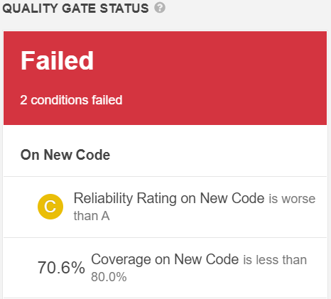

## DevSecOps

The purpose and intent of DevSecOps is to build on the mindset that “everyone is responsible for security” to safely distribute security decisions at speed and scale to those who hold the highest level of context without sacrificing the safety required. – Shannon Lietz


The PIMS Project undertake vulnerability scan as part of our software release pipeline, and do not release if "HIGH RISK" vulnerabilities are identified (Automated, Continous process)

**CODE:** 
Run Static Code Analysis in Real-time to address vulnerabilities in the code at real-time. We do not have to wait once per quarter or wait until the release to production before scanning. Open-source tools for Static Code Analysis can be used within the CI pipeline and Git Actions:

- [Sonarque](https://docs.sonarqube.org/latest/analysis/github-integration/)
- [CodeQL](https://github.com/github/codeql-action)


#### Static Code Analysis for React Frontend

The Project uses Sonarque as a Static Code Analysis and Quality Assurance Tool to collect and analyses our source code and provide reports for the code quality of our project

**Requirement:**
- [Sonarque Server](https://github.com/BCDevOps/sonarqube) (community version - free)
- Sonarque cli for Javascript/Typescript (github action)

*GitHub Actions for PIMS Frontend Static Code Analysis*

```
  - name: SonarQube Scan
        id: scan
        uses: philips-software/sonar-scanner-action@v1.2.0
        env:
          SONAR_TOKEN: ${{ secrets.SONAR_TOKEN }}
          SONAR_HOST_URL: ${{ secrets.SONAR_URL }}
          PROJECT_KEY: ${{secrets.PROJECT_KEY_APP}}
          PROJECT_NAME: PIMS-APP
          GITHUB_TOKEN: ${{ secrets.GITHUB_TOKEN }}
        with:
          baseDir: ${{env.working-directory}}
          token: ${{ env.SONAR_TOKEN }}
          projectName: ${{env.PROJECT_NAME}}
          url: ${{env.SONAR_HOST_URL}}
          isCommunityEdition: true
          projectKey: ${{env.PROJECT_KEY}}
          enablePullRequestDecoration: true
          runQualityGate: true
       
      - name: Find Comment
        if: failure() && steps.scan.outcome == 'failure' && github.event_name == 'pull_request'
        uses: peter-evans/find-comment@v1
        id: fc
        with:
          issue-number: ${{ github.event.pull_request.number }}
          comment-author: 'github-actions[bot]'
          body-includes: STATIC CODE QUALITY GATE STATUS
       
      - name: Check Quality Gate and Create Comment
        if: failure() && steps.scan.outcome == 'failure' && github.event_name == 'pull_request' && steps.fc.outputs.comment-id == ''
        uses: peter-evans/create-or-update-comment@v1
        env:
          SONAR_TOKEN: ${{ secrets.SONAR_TOKEN }}
          SONAR_HOST_URL: ${{ secrets.SONAR_URL }}
          PROJECT_KEY: ${{secrets.PROJECT_KEY_APP}}
        with:
          issue-number: ${{ github.event.pull_request.number }}
          body: |
            STATIC CODE QUALITY GATE STATUS: FAILED.
            
            [View and resolve details on][1]
            [1]: ${{env.SONAR_HOST_URL}}dashboard?id=${{env.PROJECT_KEY}}
          reactions: confused
      - name: Check Quality Gate and Update Comment
        if: failure() && steps.scan.outcome == 'failure' && github.event_name == 'pull_request' && steps.fc.outputs.comment-id != ''
        uses: peter-evans/create-or-update-comment@v1
        env:
          SONAR_TOKEN: ${{ secrets.SONAR_TOKEN }}
          SONAR_HOST_URL: ${{ secrets.SONAR_URL }}
          PROJECT_KEY: ${{secrets.PROJECT_KEY_APP}}
        with:
          comment-id: ${{ steps.fc.outputs.comment-id }}
          issue-number: ${{ github.event.pull_request.number }}
          body: |
            STATIC CODE QUALITY GATE STATUS: FAILED.
            
            [View and resolve details on][1]
            [1]: ${{env.SONAR_HOST_URL}}dashboard?id=${{env.PROJECT_KEY}}
          edit-mode: replace
          reactions: eyes
```


***Set Quality Gate to TRUE to failed merge on PR***

If this is set, sonar scan quality gate must be passed before merge into the master branch
 
##### Pull Request Decoration
- [Quality Gate](https://docs.sonarqube.org/latest/user-guide/quality-gates/) and Metrics in the PR!
- Live update in any issue chanage
- PR status update (merge block)


Click on the link will redirect you the Sonarque Scanner Quality Gate reports as below



#### Static Code Analysis for .Net 5 API Backend

```
      - name: SonarScanner for .NET 5 with pull request decoration support
        id: scan
        uses: highbyte/sonarscan-dotnet@2.0
        env:
          SONAR_TOKEN: ${{ secrets.SONAR_TOKEN }}
          GITHUB_TOKEN: ${{ secrets.GITHUB_TOKEN }}
        with:
          dotnetBuildArguments: ${{env.working-directory}}
          dotnetTestArguments: ${{env.working-directory}} --logger trx --collect:"XPlat Code Coverage" -- DataCollectionRunSettings.DataCollectors.DataCollector.Configuration.Format=opencover
          # Optional extra command arguments the the SonarScanner 'begin' command
          sonarBeginArguments: /d:sonar.cs.opencover.reportsPaths="**/TestResults/**/coverage.opencover.xml" -d:sonar.cs.vstest.reportsPaths="**/TestResults/*.trx" -d:sonar.qualitygate.wait=true
          # The key of the SonarQube project
          sonarProjectKey: ${{secrets.PROJECT_KEY_API}}
          # The name of the SonarQube project
          sonarProjectName: PIMS-API
          # The SonarQube server URL. For SonarCloud, skip this setting.
          sonarHostname: ${{secrets.SONAR_URL}}
          
      - name: Find Comment
        if: failure() && steps.scan.outcome == 'failure' && github.event_name == 'pull_request'
        uses: peter-evans/find-comment@v1
        id: fc
        with:
          issue-number: ${{ github.event.pull_request.number }}
          comment-author: 'github-actions[bot]'
          body-includes: QUALITY GATE STATUS FOR .NET 5
          
      - name: Check Quality Gate and Create Comment
        if: failure() && steps.scan.outcome == 'failure' && github.event_name == 'pull_request' && steps.fc.outputs.comment-id == ''
        uses: peter-evans/create-or-update-comment@v1
        env:
          SONAR_TOKEN: ${{ secrets.SONAR_TOKEN }}
          SONAR_HOST_URL: ${{ secrets.SONAR_URL }}
          PROJECT_KEY: ${{secrets.PROJECT_KEY_API}}
        with:
          issue-number: ${{ github.event.pull_request.number }}
          body: |
            QUALITY GATE STATUS FOR .NET 5: FAILED.
            
            [View and resolve details on][1]
            [1]: ${{env.SONAR_HOST_URL}}dashboard?id=${{env.PROJECT_KEY}}
          reactions: confused
      - name: Check Quality Gate and Update Comment
        if: failure() && steps.scan.outcome == 'failure' && github.event_name == 'pull_request' && steps.fc.outputs.comment-id != ''
        uses: peter-evans/create-or-update-comment@v1
        env:
          SONAR_TOKEN: ${{ secrets.SONAR_TOKEN }}
          SONAR_HOST_URL: ${{ secrets.SONAR_URL }}
          PROJECT_KEY: ${{secrets.PROJECT_KEY_APP}}
        with:
          comment-id: ${{ steps.fc.outputs.comment-id }}
          issue-number: ${{ github.event.pull_request.number }}
          body: |
            QUALITY GATE STATUS FOR .NET 5: FAILED.
            
            [View and resolve details on][1]
            [1]: ${{env.SONAR_HOST_URL}}dashboard?id=${{env.PROJECT_KEY}}
          edit-mode: replace
          reactions: eyes
```

### Workflow

