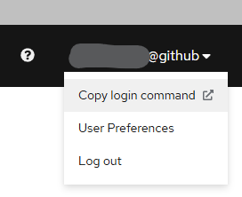
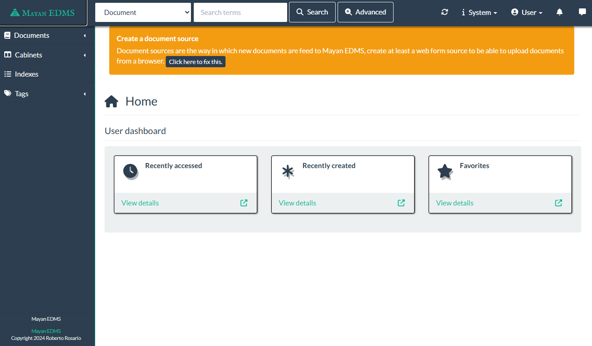

# MAYAN-EDMS

[Mayan official site](https://www.mayan-edms.com/)
[Mayan documentation](https://docs.mayan-edms.com/index.html)

EDMS Functionality

- Documents such as forms, contracts, reports, and letters.
- Managing the entire document lifecycle, from its creation onwards, where live editing in the system is possible.
- Providing audit trails, showing who accessed a document and which changes were made.
- Check-in, check-out, and locking, where the changes of a user won’t overwrite the changes of the previous user.
- Controlling and managing different versions and making sure there's one single source of truth.
- Activating a prior version of a document.
- Sharing documents, where it is easy to circulate large files.
- Tags, author name, document name and the description of a publication.

## Prerequisites

- Docker and docker-compose must be installed and running.
- OpenShift CLI (oc) must be installed and accessible in the PATH.
- You have access to the **3cd915-tools** namespace

## Setup

### Login to OpenShift via oc-cli

Open web console at https://console.apps.silver.devops.gov.bc.ca/k8s/cluster/projects

Make sure you have access to **3cd915-tools** namespace

Click on your user profile and under the menu, click **Copy login command**



This will open a new tab with the token to login like so:

```
oc login --token=[...] --server=https://api.silver.devops.gov.bc.ca:6443
```

Paste the above command in git-bash. Your OpenShift projects should be listed

```
Logged into "https://api.silver.devops.gov.bc.ca:6443" as "YOURUSERNAME@github" using the token provided.

You have access to the following projects and can switch between them with 'oc project <projectname>':

    3cd915-dev
  * 3cd915-tools

Using project "3cd915-tools".
```

**NOTE:** If you are not using the tools project, switch to it with `oc project 3cd915-tools`

### Pull mayan image from OpenShift container registry

First, you need to login to OpenShift container registry.

```bash
docker login -u $(oc whoami) -p $(oc whoami -t) image-registry.apps.silver.devops.gov.bc.ca
```

Then, pull the mayan image hosted on OpenShift container registry

```bash
docker pull image-registry.apps.silver.devops.gov.bc.ca/3cd915-tools/mayan-bcgov:4.7.1
```

**NOTE:** The mayan version used at the time of writing this instructions is `4.7.1`

Verify that the image was pulled succesfully to your computer by running `docker images` command on your console:

```
IMAGE                                                                        ID             DISK USAGE   CONTENT SIZE   EXTRA
image-registry.apps.silver.devops.gov.bc.ca/3cd915-tools/mayan-bcgov:4.7.1   ea46268a1654       3.46GB          939MB    U
...
```

### Build the local mayan containers

```bash
make mayan-up
```

This will start the mayan-frontend service on the 7080 port. If the admin password has not been changed, mayan will create a new one for the admin and display it until it is changed.

Verify mayan is working by navigating to http://localhost:7080 on your browser. You should see a welcome page with the default admin password.



## License

```
Copyright 2021 Province of British Columbia

Licensed under the Apache License, Version 2.0 (the "License");
you may not use this file except in compliance with the License.
You may obtain a copy of the License at

   http://www.apache.org/licenses/LICENSE-2.0

Unless required by applicable law or agreed to in writing, software
distributed under the License is distributed on an "AS IS" BASIS,
WITHOUT WARRANTIES OR CONDITIONS OF ANY KIND, either express or implied.
See the License for the specific language governing permissions and
limitations under the License.
```
